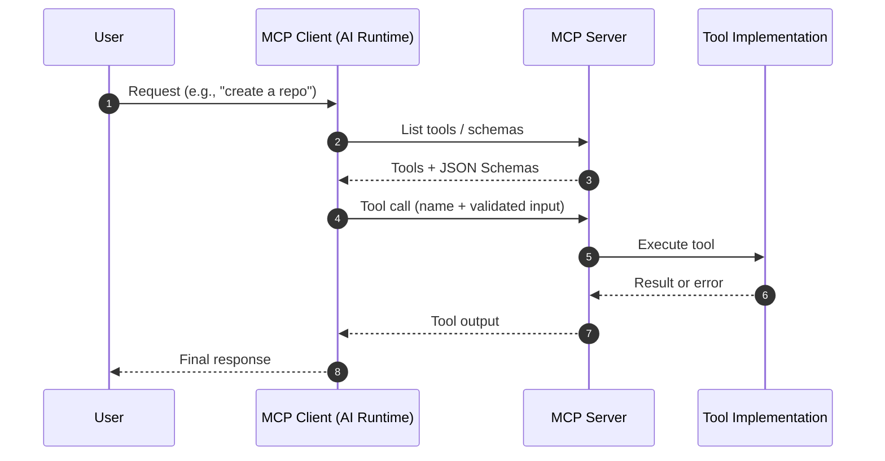

# Model Context Protocol (MCP) — Documentation

## Overview
Model Context Protocol (MCP) is a protocol that allows tools/servers to expose capabilities to AI clients in a consistent, inspectable way. It standardizes how:

- **Clients** discover available tools and their schemas
- **Servers** advertise and execute tools
- **Requests/Responses** are structured and exchanged

This enables an AI assistant to call external functions safely and deterministically using well-defined inputs and outputs.

## Core Concepts

### MCP Client
An application (e.g., an AI assistant runtime) that:
- connects to an MCP server
- lists available tools
- invokes tools with validated inputs
- consumes tool outputs and errors

### MCP Server
A service that:
- exposes one or more tools
- provides tool metadata (name, description, JSON schema)
- executes tool calls and returns results

### Tool
A callable capability exposed by the server.
A tool typically includes:
- a **name**
- an **input schema** (often JSON Schema)
- an **output payload** (arbitrary JSON)
- **error reporting** conventions

## Typical Flow
1. Client connects to server.
2. Client requests tool list and schemas.
3. User asks for something requiring a tool.
4. Client selects a tool and constructs input.
5. Server executes and returns output or error.

## Mermaid Schema


## Example Tool Shape (Illustrative)
```json
{
  "name": "create-or-update-file-github",
  "description": "Creates or updates a file in a repository",
  "inputSchema": {
    "type": "object",
    "required": ["owner", "repo", "path", "message", "content"],
    "properties": {
      "owner": {"type": "string"},
      "repo": {"type": "string"},
      "path": {"type": "string"},
      "message": {"type": "string"},
      "content": {"type": "string"}
    }
  }
}
```

## Notes / Best Practices
- Prefer **small, composable tools**.
- Validate inputs against schema before execution.
- Return structured errors (machine-readable) where possible.
- Keep tool outputs deterministic and minimize side effects unless explicitly requested.
