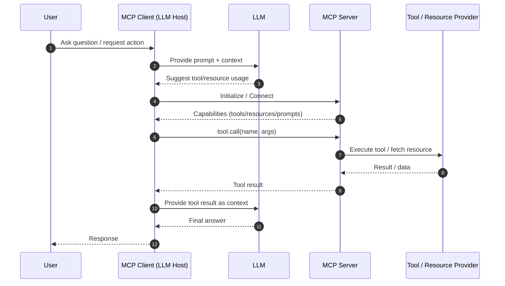

# Model Context Protocol (MCP) Documentation

This document provides a concise overview of the **Model Context Protocol (MCP)**, including its core concepts, typical message flow, and a Mermaid diagram describing how clients, servers, and tools interact.

## What is MCP?

MCP is a protocol for connecting LLM-powered applications (clients) with external capabilities exposed by MCP servers. Those capabilities commonly include:

- **Tools** (callable actions/functions)
- **Resources** (readable content/data)
- **Prompts** (reusable prompt templates)

An MCP client can:

1. Discover what an MCP server exposes (tools/resources/prompts)
2. Invoke tools with structured inputs
3. Retrieve resources
4. Maintain a consistent interaction pattern across many servers

## Key Concepts

- **MCP Client**: The host application using an LLM and wanting to call external tools/resources.
- **MCP Server**: A service that exposes tools/resources/prompts over MCP.
- **Tool**: A callable function with a JSON schema-defined input and structured output.
- **Resource**: Read-only (or fetchable) data such as files, documents, database records, etc.
- **Transport**: The mechanism used to communicate (implementation-dependent), e.g., stdio, HTTP.

## Typical Flow

1. Client connects to server
2. Client requests server capabilities
3. LLM decides a tool/resource is needed
4. Client calls the tool (or fetches the resource)
5. Server returns results
6. Client feeds results back to the LLM for final response

## Mermaid Schema

## Notes on Tool Definitions

Tools are typically described by:

- **name** (string identifier)
- **description** (what it does)
- **inputSchema** (JSON Schema)
- **output** (structured data, often JSON)

This makes tool invocation deterministic and machine-validated, which is especially important for robust automation.
